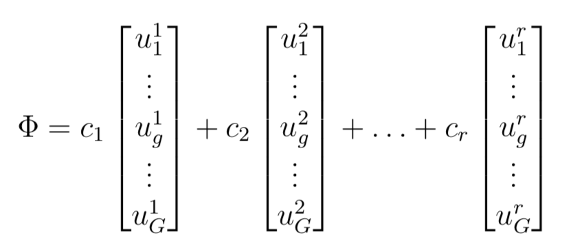
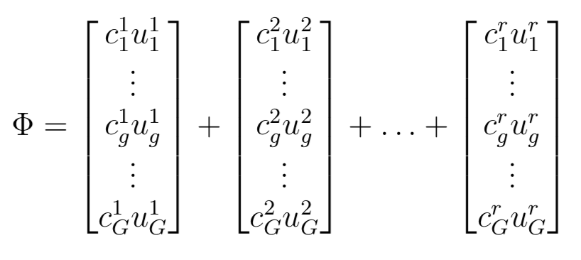
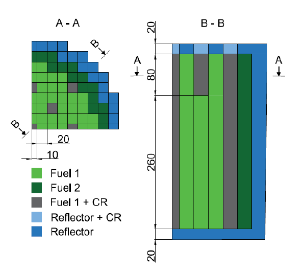
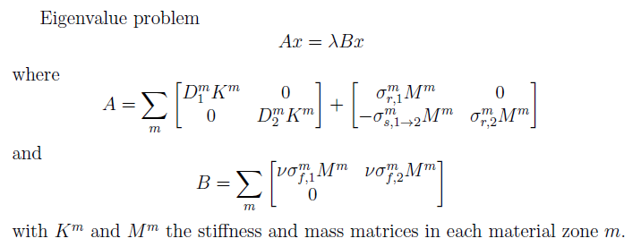
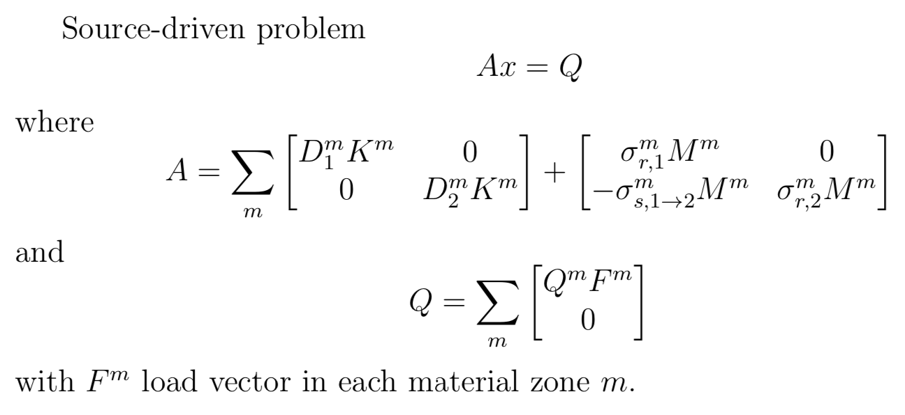

# POD for eigenvalue and source-driven problems
POD for 2-g neutron diffusion criticality eigenproblems (and comparison with 2-g fixed-source problems).  

## Purpose
This small code exemplifies some issues observed when using projection-based model-order reduction for the multigroup neutron diffusion equations.

Two Reduced-Order Models (ROM) are considered. Both of them use snapshots (multigroup flux solutions) generated by varying the cross-section values.
*  the first ROM (ROM-1) performs an SVD decomposition on the full snapshot matrix and seeks the solution as an expansion in POD modes using using


*  the second ROM (ROM-2) performs two SVD decompositions, one per energy group, but using exactly the same snapshots as ROM-1, but seeks the solution as an expansion in POD modes using using


In a nutshell, ROM-1 uses the same expansion coefficient per multigroup mode, while ROM-2 uses a group-dependent expansion coefficient. Also note that it is not necessary to perform two SVD decompositions for ROM-2. It only suffices to separate the POD modes into their group-wise components.

 Then, both ROMs perform a Galerkin projection to obtain the reduced eigenvalue problem.

The reduced eigenproblem of ROM-1 often has large errors when compared to the Full-Order Model (FOM) solution. ROM-2 never exhibits such errors. To further analyze this, we decided
* to never truncate the ROMS (that is the ROM rank is always equal to the number of snapshots used)
* to test the ROMs on the training set (expecting machine precision errors only).

More details can be found in the following paper ```Add reference to ANUCENE paper when published```.

## Provided test case

#### Eigenvalue problem
For our test case, we use the 3D LWR core benchmark data found in the Argonne benchmark problem book:
R. R. Lee, D. A. Maneley, B. Micheelsen, D. R. Vondy, M. R. Wagner, W. Werner, Multi-dimensional (x-y-z) LWR Model, ANL-7416 supplement 2, benchmark problem 11, Argonne National Laboratory, Illinois, USA (1977).  



A finite-element model of the problem has been built using the open-source FEM library [deal.ii](https://www.dealii.org), version 9.0.1.

#### Source-driven problem

A fixed-source version of this benchmark problem has been generated using material-wise constant external source strengths (of values 2, 3, and 4, in the fast group for the 3 fuel regions; and of value 0 in the thermal range in all reflector zones).

## Codes

#### Eigenvalue problem

Four files are included:
1. ```build_full_system_matrix.m```

Given a set of material properties, the matrices for full system are assembled using region-dependent elementary matrices, as follows:  




2. ```generate_snapshots_lhs.m```

Varies the nominal parameters; samples them using Latin Hypercube; generate as many snapshots are requested and saves them in a file.

Four series of snapshots are provided if you do not want to re-generate them.


3. ```pod_test_anucen.m```

For a given training data point (i.e., a set of material properties used to generate the FOM snapshot), compute the ROM-1 and ROM-2 eigenvalues and compare them to the FOM eigenvalue.

4. ```pod_check_driver.m```

Driver to go through of all the training data points and compare FOM, ROM-1, and ROM-2.

#### Source-driven problem

Four similar files are included for the fixed-source problems. Their filenames contain ```_fixed_src```.

The system assembly proceeds similarly, see below:



## License
GNU GPLv3
